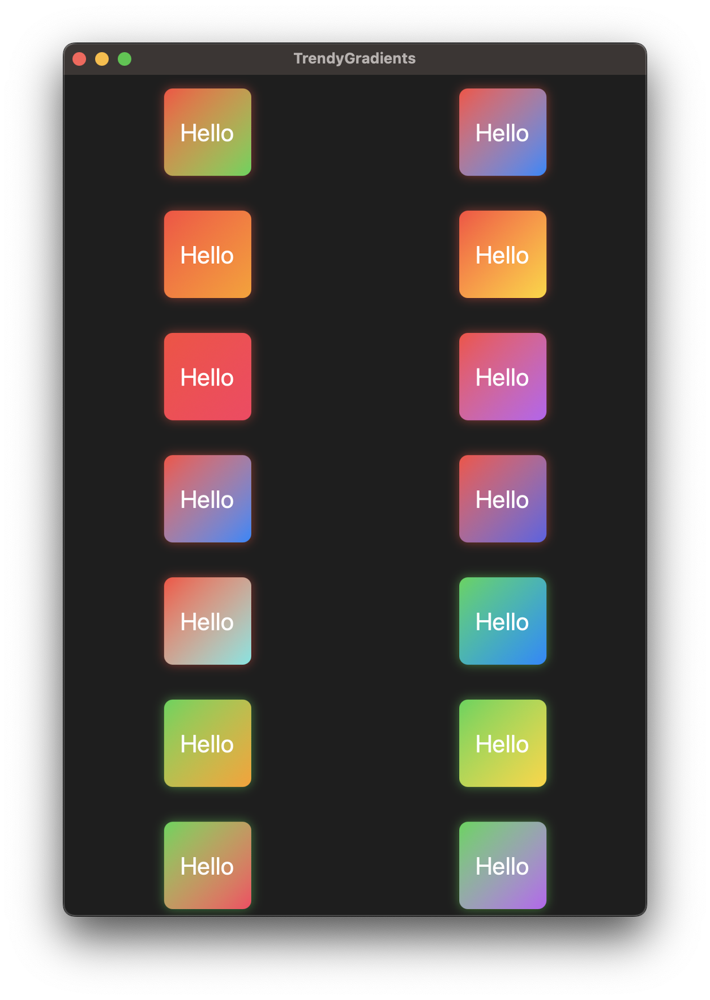

# TrendyGradients

Super cool boxes with trendy neon gradient backgrounds for SwiftUI.



```swift
import SwiftUI

struct ContentView: View {
    let colors: [Color] = [
        .red, .green, .blue, .orange, .yellow, .pink, .purple, .blue, .indigo, .mint
    ]
    
    var body: some View {
        ScrollView {
            let columns: [GridItem] = Array(repeating: .init(.flexible()), count: 2)
            
            LazyVGrid(columns: columns) {
                ForEach(0..<colors.count, id: \.self) { i in
                    ForEach(i+1..<colors.count, id: \.self) { j in
                        GradientView(colors: (colors[i], colors[j]))
                            .padding()
                    }
                }
            }
        }
    }
}

struct GradientView: View {
    let colors: (Color, Color)
    
    var body: some View {
        Text("Hello")
            .font(.title)
            .foregroundColor(.white)
            .frame(width: 100, height: 100, alignment: .center)
            .background(
                RoundedRectangle(cornerRadius: 10)
                    .fill(
                        LinearGradient(
                            gradient: Gradient(colors: [colors.0, colors.1]),
                            startPoint: .topLeading,
                            endPoint: .bottomTrailing
                        )
                    )
                    .shadow(color: colors.0.opacity(0.5), radius: 6, x: 0.0, y: 0.0)
            )
    }
}

```