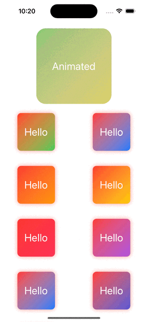

# TrendyGradients

Super cool boxes with trendy neon gradient backgrounds for SwiftUI. Use the provided ViewModifiers or copy pasta and make your own :) 



## Installation

### Swift Package Manager

Add the following to your `Package.swift` file:

```swift
dependencies: [
    .package(url: "https://github.com/drewalth/TrendyGradients.git", from: "1.0.0")
]
```

## Usage
    
### ViewModifier - Default

```swift
import TrendyGradients

struct ContentView: View {
    var body: some View {
        VStack {
            Text("Hello, World!")
                .padding()
                .background(TrendyGradient())
                .cornerRadius(10)
                .padding()
        }.trendyGradients(colors: (Color.pink, Color.purple))
    }
}
```

### ViewModifier - Animated

```swift
import TrendyGradients

struct ContentView: View {
    var body: some View {
        VStack {
            Text("Hello, World!")
                .padding()
                .background(TrendyGradient())
                .cornerRadius(10)
                .padding()
        }.animatedTrendyGradients(colors1: [Color.red, Color.blue], colors2: [Color.green, Color.yellow])
    }
}
```